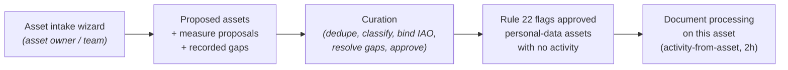

# Cairn — Slice 2i Plan: Asset Intake Wizard

**Status:** v0.1 — **built (2026-07-30), closing backlog item 25.** All three sub-slices (§5) are on `main` (or, for 2i.3, its review branch): the `question_set` generalisation and reseed mechanics (2i.1); the `/intake/assets` wizard, populates handlers and seeded *Cairn IAR Question Set v0.1* (`Cairn-iar-questions.md`, 2i.2); and gaps-queue/asset-detail curation surfacing (2i.3, below). §7's open questions are resolved as noted there.
**Derives from:** *IAR Plan* v0.1 §5.3/§7 (the capture route and slice definition), *Intake & Pilot Plan* v0.1 (the intake-in-Cairn pattern this reuses), *Information Audit Question Set* v0.1 (the content precedent), backlog items 7/8 (reseed mechanics and question-set admin, both served by the generalisation here).
**What 2i delivers:** a guided, jargon-free intake wizard through which asset owners across the organisation describe the information assets their teams hold — producing **proposed `InformationAsset` records**, vocabulary proposals and explicit gap records for curator follow-up, exactly as the activity intake wizard does for processing activities.

---

## 1. What asset intake is (and is not)

Asset intake is the third capture route from IAR Plan §5 — after manual entry (2g) and CSV import (2h) — and follows the intake-in-Cairn decision: **a wizard front end over the proposed-asset model, not a separate capture store**.

- Each completed run creates one **`InformationAsset` with `entry_status = proposed`**, for curator approval through the existing `/assets` register.
- Answers naming security measures link to the vocabulary or become **proposals** (existing propose-and-approve).
- **"Don't know" is a first-class answer**, recorded as an `IntakeGap` for the follow-up queue — not an empty field.
- The question set is **configuration, not code** (wording, hints, options, `depends_on` conditional logic as seeded rows); the field mappings ("Populates") are handlers in code.

**Not in 2i:** classification and `s62_logging_in_scope` are *not* asked — they need IG judgement and are set at curation. Asset intake does not create activities; rule 22 then does its job, flagging approved personal-data assets awaiting a documented activity — the audit pipeline is *inventory → asset approved → rule 22 → activity documented*.

---

## 2. Engineering design

### 2.1 The `question_set` generalisation (2i.1 — the prerequisite)

The intake tables currently assume a single question set. Changes, in one forward-only migration:

| Change | Detail |
|---|---|
| `intake_question.question_set` | New enum `IntakeQuestionSet` (`activity` \| `asset`), server default `activity` (backfills existing rows). Question `code` stays globally unique — asset codes use an `AS-` prefix. |
| `intake_submission.question_set` | Same enum, default `activity`. |
| `intake_submission.subject_name` | **Rename** of `activity_name` — it is the name of whatever the run documents (activity name or asset label). Pre-beta rename, consistent with the 2g table renames. |
| `intake_submission.asset_id` | Nullable FK to `information_asset` — the created asset, mirroring `activity_id`. |
| `intake_gap.asset_id` | Nullable FK to `information_asset`, mirroring `activity_id`, so asset gaps resolve against the asset. |

**Seeding and reseed mechanics (serves backlog item 7):** `seed_intake_questions` is refactored to seed per question set, with an idempotent per-set reseed helper (no-op where rows exist) that a later admin screen (backlog item 8) or one-off backfill can call. Activity-intake behaviour must not change — 2i.1 lands with the existing intake test suite green as its regression gate.

### 2.2 The asset wizard (2i.2)

- **Routes:** `/intake/assets` namespace (start → sections → review → submit), sharing the wizard engine (rendering, `depends_on` evaluation, don't-know handling, answer normalisation) with the activity wizard; the engine is parameterised by question set, not duplicated.
- **Start screen** mirrors activity intake: department (business function), respondent, and the asset's name (→ `label`).
- **Populates handlers** — a second registry mapping the §4 codes onto `InformationAsset` fields. Notable mappings:
  - *Business functions are multi-valued* (requirement recorded 2026-07-28, `asset_businessfunction` junction): the respondent's department from the start screen becomes the asset's first business function, and AS-B3 ("which other teams use it?") adds further label-matched functions — unmatched names land in `notes` with a gap.
  - *IAO named in answers is text, not an account pick.* Respondents rarely know user emails; the named person lands in `notes` ("Named senior owner: …") plus a gap, and the curator binds `iao_user_id` on approval. Deny-by-default account linking is preserved.
  - *Supplier and retention answers match by label* (case-insensitive) against Legal Entity / Retention Rule; unmatched values are recorded in `notes` with a gap — neither vocabulary is auto-proposable from a bare name (same rule as the CSV import).
  - *Security measures* use the existing `VOCAB_MULTI` kind against the security-measure vocabulary, proposing unmatched entries.
- **RBAC:** same as activity intake — contributors and above run it, scoped to their function; curators/DPO see all submissions.
- **No new engine rules.** Rule 22 already provides the follow-through signal once assets are approved.

### 2.3 Curation surfacing (2i.3) — built

- The **gaps queue** (`/intake/gaps`) shows asset gaps alongside activity gaps: each card names which question set it is and links to the right record ("Draft activity" → `/activities/{id}` or "Proposed asset" → `/assets/{id}`); the resolved table's first column is the generic "Record", not "Activity"; the intro wording covers both records. One list, no separate queues, as planned — the existing resolve/reopen routes needed no change (they were already set-agnostic).
- The **asset detail page** shows "created from intake" (the asset counterpart of backlog item 12 — done for assets first, deliberately): who the respondent was and their contact if given, a link to the full submission, the submission's answers (reusing `answer_display`/`_questions`/`_display_map` from `cairn.intake` — no second renderer), and the open gaps for that asset. Renders nothing for manually-created or CSV-imported assets.
- Approving the proposed asset happens in the existing `/assets` register — no new approval surface.

---

## 3. Pipeline

Duplicate handling is a curation concern, as with the CSV import: curators see proposed assets against the register and reject duplicates (the import's case-insensitive label match is the model; a like-named-asset hint on the start screen is an open question, §7).

---

## 4. Draft IAR Question Set v0.1

To be extracted, on sign-off, into its own document (*Cairn IAR Question Set v0.1*, mirroring `Cairn-information-audit-questions.md`) before seeding. Start screen collects department, respondent and asset name (→ `label`). "Don't know" is available on every question and records a gap.

| Code | Section | Question (plain English) | Hint | Kind | Populates |
|---|---|---|---|---|---|
| AS-A1 | A — What it is | Which of these best describes it? | A computer system or online service · a database or large collection of records · a software application · paper files or records · equipment, devices or media that hold information | single_choice | `asset_type` |
| AS-A2 | A | In plain English, what is it and what is it used for? | | textarea | `description` |
| AS-A3 | A | Is it still in everyday use? | Still used · being phased out or replaced · no longer used at all | single_choice | `status` |
| AS-B1 | B — Who looks after it | Who looks after it day to day? | A person or team, e.g. "HR admin team" | text | `custodian` |
| AS-B2 | B | Who is the senior person responsible for it? | The person who would decide if it changed or was got rid of — its owner | text | `notes` + gap → curator binds `iao_user_id` |
| AS-B3 | B | Do any other teams or departments use or rely on it? Which ones? | Your own department is already recorded — list any others | text | `business_functions` (label match; unmatched → `notes` + gap) |
| AS-C1 | C — The information it holds | Does it hold information about people? | Staff, the public, anyone — however routine | yes_no | `contains_personal_data` |
| AS-C2 | C *(if C1 = yes)* | Roughly what information about people does it hold? | Names and contact details? Health information? Photographs or recordings? | textarea | `notes` (curation context) |
| AS-D1 | D — Where it is | Where is it kept? | A building or room for paper; a supplier, data centre or "the cloud" for systems | text | `location` |
| AS-D2 | D | Is it provided or hosted by an outside company? Which one? | | text | supplier match → `supplier_entity_id`, else `notes` + gap |
| AS-D3 | D *(if D2 answered)* | Is any of the information kept outside the UK? Where? | | text | `hosting_country` |
| AS-E1 | E — How it's protected | How is it protected? | Locked rooms or cabinets, passwords, restricted access, encryption — pick all that apply or suggest new ones | vocab_multi (security measures) | `security_measures` (+ proposals) |
| AS-F1 | F — Keeping and disposing | How long is the information kept, and is that written down anywhere? | | text | retention match → `default_retention_id`, else `notes` + gap |
| AS-F2 | F | When should this asset next be checked or reviewed? | Leave blank if you don't know | date | `next_review_date` |

---

## 5. Build sub-slices

Per-slice rhythm as established (branch, TDD, full suite + live drive, docs, commit on approval).

| Sub-slice | Contents | Gate | Status |
|---|---|---|---|
| **2i.1 — generalisation** | Migration (§2.1), enum, seed refactor + reseed helper, `subject_name` rename ripple | Existing activity-intake suite green, no behaviour change | **Built** |
| **2i.2 — asset wizard** | Question Set v0.1 doc extracted + seeded; `/intake/assets` routes; asset populates handlers; proposed asset + proposals + gaps on submit; nav entry | Wizard round-trip test: run → proposed asset with correct fields, gaps recorded | **Built** |
| **2i.3 — curation surfacing** | Asset gaps in the queue; "created from intake" on asset detail; pilot artefacts (P1 checklist, comms pack) and doc updates | Gap resolve/reopen against an asset; docs current | **Built** |

---

## 6. Impact on existing documents

| Document | Change |
|---|---|
| *Cairn IAR Question Set v0.1* | **New** — extracted from §4 on sign-off |
| IAR plan / backlog | Build-status lines; item 25 closes, items 7/8 note the delivered reseed mechanics |
| Intake & Pilot Plan | Note the second question set and the asset-inventory wave option |
| Pilot artefacts | P1 seeding checklist (seed both sets), comms pack (asset-intake invitation wording) |
| CLAUDE.md / product description / admin reference | Intake described as two question sets; asset capture routes complete |

---

## 7. Out of scope and open questions

**Out of scope for 2i:** question-set admin UI (backlog 8 — the generalisation enables it, evidence decides it); classification/s62 capture in the wizard (curation); asset hierarchy (IAR plan deferred list); any change to the activity question set.

**Resolved:**

1. **Wave targeting — decided.** Asset intake is invited **function-by-function, alongside the audit waves** (`Cairn-intake-pilot-plan.md` §5) — not opened to all contributors at once. Comms-pack consequence only; the build was already the same either way (`Cairn-pilot-comms-pack.md` §3).
2. **Duplicate hint on the start screen — built.** The like-named-asset hint (`/intake/assets/similar`, an htmx fragment against the asset label as the respondent types) shipped in 2i.2.

**Still open:**

3. **IAO wording.** "The senior person responsible" (AS-B2) remains the working plain-English rendering of Information Asset Owner — **provisional, no decision taken**, pending confirmation from the SIRO / Information Governance team on whether the organisation has preferred house terminology. Treat it as draft wording to sign off, not settled (see the same caveat in `Cairn-iar-questions.md` §Section B).
