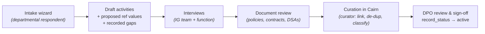

# Cairn — Intake & Information Audit Pilot Plan

**Status:** v0.1 — for iteration. Detail (durations, resourcing) deferred to future engagements. **Build status (2026-07): the pulled-forward slice (§4) is delivered on `main`** — intake wizard (`src/cairn/intake.py`, question set seeded per §2) and the gaps curation queue (`/intake/gaps`, audited resolve/reopen with resolution notes). **Addendum (2026-07-30):** a second question set now runs through the same wizard — asset intake, §5.
**Decision recorded:** the information-audit questionnaire is **built into Cairn as its intake screen**, and the organisation-wide information audit is run **through Cairn as the pilot**. No intermediate capture tool (MS Forms / SharePoint list / Excel) is built.
**Derives from:** *Cairn Project Plan* v0.1 (Phases 2d & 4), *Plan v0.12* §5 (workflow, hybrid authoring), *Spec v0.3* (fields), *Cairn Information Audit Question Set* v0.1 (content).

---

## 1. Why this approach

- **No capture-then-migrate step.** Any intermediate tool creates a mapping layer and an ingestion project that must be built, reconciled and then thrown away. Intake-in-Cairn removes that workstream entirely.
- **Controlled vocabularies enforced at source.** Answers select from the Spec §7 vocabularies (with propose-new for gaps), so the audit produces linked, granular records — the ICO's "meaningful links" — rather than free text needing curation.
- **The audit *is* the pilot.** Real users, real activities, real data quality problems — surfaced against the actual system rather than a proxy. Pilot feedback improves both the intake experience and the underlying model before full rollout.
- **The question set already maps to fields.** The Question Set v0.1 was written with a "Populates" column per question; intake screens implement that mapping directly.

**Trade-off accepted:** the audit cannot start until Cairn's intake is buildable — the audit timeline is now coupled to the Phase 2 build. Mitigation: intake needs only a subset of Cairn (§4), so it can be sequenced early.

---

## 2. What "intake" is in Cairn terms

Intake is a **guided, wizard-style front end over the draft-activity model** — not a separate data store:

- Each completed intake run creates a **Processing Activity in `record_status = draft`**, with its junction links (data subjects, data categories, recipients, systems, sources) populated from the answers.
- Answers that match controlled vocabulary values link directly; answers that don't become **proposed reference values** for curator approval (Plan §5.1 propose-and-approve).
- "Don't know" is a first-class answer, stored as an explicit gap for IG follow-up — not an empty field.
- The **question set is configuration, not code**: questions, help text, prompt lists and section flow are held as data (per sector pack), so wording can iterate without rebuilds — consistent with Cairn's configurable-core principle.
- Section K (enforcement) renders **conditionally** from the respondent's business function; the trial/pilot questions map to `lifecycle_stage`. **Question-level conditional logic is also configuration** (`depends_on` per question): follow-ups reveal only when their parent answer applies (GOV.UK conditional-reveal pattern), cross-section dependencies gate rendering, answers whose condition is no longer met are normalised to *not applicable* server-side, and the one true contradiction (C4/C5 — processor *and* joint) is rejected with an error rather than silently resolved.

**Out of scope for intake:** lawful-basis determination, regime classification, DPIA completion, sign-off. Intake gathers facts; curation and approval turn facts into compliant records (the C→curate→approve pipeline below).

---

## 3. The pipeline

The ICO's three-step method (questionnaire → interviews → document review) is preserved; steps 2–3 work *on the draft records in Cairn*, with interviews resolving the recorded gaps and document review validating against reality ("would the record match what people are currently doing?").

---

## 4. Build dependency — the minimum Cairn needed for intake

Intake does not require all of Phase 2. Minimum set, mapped to the Project Plan:

| Needed from | What |
|-------------|------|
| 2a (core) | Processing Activity + junctions; reference vocabularies loaded (FRS pack); Organisation Profile; `record_status`/`lifecycle_stage` |
| 2d (workflow, partial — pulled forward) | Contributor role + function scoping; **intake wizard**; propose-and-approve for reference values; draft/curate states |
| Not needed for intake | 2b lawful basis (curation-stage), 2c linked registers (except stub links), 2e export, 2f DUAA extras |

**Sequencing consequence:** the intake wizard and propose-and-approve mechanics move **forward** in the build order — effectively "2a + intake slice of 2d" become the pilot-enabling milestone. Full 2d (review cycles, questionnaire re-use for periodic review) completes later.

---

## 5. Pilot design

**Scope:** one or two business functions first — recommended **Prevention & Community Safety** (rich in the hard cases: vulnerable people, children, external data, EMR-adjacent) and **HR** (conventional, high-volume, good contrast). Then extend department-by-department; the full audit *is* the extended pilot.

**Pilot stages:**

| Stage | Activity | Output |
|-------|----------|--------|
| P1 | Seed vocabularies (Spec §7) + Organisation Profile; load question set as config — worked checklist: `Cairn-pilot-p1-seeding-checklist.md` | Intake-ready instance |
| P2 | Walkthrough with IG team acting as respondents (dry run) — script: `Cairn-pilot-p2-dryrun-script.md` | Wording/flow fixes before real users |
| P3 | Pilot function 1 & 2 respondents complete intake; IG observes — communications: `Cairn-pilot-comms-pack.md` | Draft activities + usability findings |
| P4 | Interviews + document review on the drafts; curation; first DPO sign-offs | First `active` records; curation-load measurement |
| P5 | Retrospective: question wording, vocabulary gaps, wizard UX, rule friction | Question-set v0.2; backlog for full rollout |
| P6 | Rollout to remaining departments in waves | Complete information audit = populated ROPA |

**Success measures (indicative):** % of activities entered without IG hand-holding; % of answers matched to controlled vocabularies vs proposed-new; gaps recorded vs guessed; curation time per activity; respondent feedback; and — the ICO test — spot-checks confirming records match actual practice.

**Asset intake (slice 2i, 2026-07-30).** Cairn's intake wizard now carries a **second question set** alongside the one above: the *Cairn IAR Question Set v0.1* (`Cairn-iar-questions.md`), run at `/intake/assets`, producing a proposed `InformationAsset` (system, database, application, or collection of paper/physical records) instead of a draft activity — an intake-driven option for building the asset inventory, alongside the CSV bulk import already available at P1. **Decided:** asset intake is invited **function-by-function, alongside the audit waves in the table above** — not opened to all contributors at once. See `Cairn-pilot-comms-pack.md` §3 for the asset-intake invitation wording, and `Cairn-pilot-p1-seeding-checklist.md` §D for verifying both question sets are seeded before a wave starts.

---

## 6. Risks & mitigations

| Risk | Mitigation |
|------|------------|
| Audit timeline coupled to build | Minimum-slice dependency (§4); pull intake forward; stage rollout so later departments aren't blocked by early findings |
| Respondents overwhelmed by a system rather than a form | Wizard UX with plain-language questions (the Question Set's jargon-free rule); pre-fill known activities so people correct rather than create; IG support in pilot waves |
| Vocabulary churn from propose-new flood | Curator triage cadence during pilot; seed lists are already comprehensive (Spec §7.9–7.14) |
| Draft-quality data mistaken for approved ROPA | `record_status` gates + export views exclude drafts; visual state cues in UI |
| Pilot findings force model changes | That is the pilot's purpose — timed before full rollout; spec/plan iterate by version as established |

---

## 7. Consequential updates to other documents

- **Project Plan v0.1 → v0.2:** Phase 4 retitled to reflect that the information audit runs *through Cairn* as the pilot (no separate migration-from-questionnaire step; migration now covers only the legacy ROPA); Phase 2 notes the pulled-forward intake slice; §11 assumption 5 (pilot scope) resolved as Prevention + HR (proposed).
- **Question Set v0.1:** stands as the content source; its "Populates" mapping becomes the intake-screen specification. §3's practical notes (pre-fill, shadow data, senior sponsorship) carry into pilot comms. A v0.2 will follow the pilot retrospective (P5).

---

*Cairn — Intake & Information Audit Pilot Plan v0.1. Will iterate as the Phase 2 build is planned in detail.*
