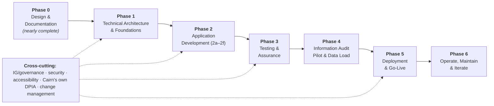

# Cairn — Overall Project Plan

**Status:** Project Plan v0.2 — high-level roadmap for iteration. Detailed planning (resourcing, durations, costs) is deferred to future engagements.
**System:** *Cairn* — a single-tenant, configurable Record of Processing Activities (ROPA) and accountability tool; the Fire and Rescue Service (FRS) is the first sector profile.
**Derives from:** *ROPA Tool — High-Level Plan & Data Architecture* (**Plan v0.12**, `ROPA-tool-plan.md`) and *ROPA Tool — Field-Level Build Specification* (**Spec v0.3**, `ROPA-tool-field-spec.md`).

---

## 1. Approach

- **Outcome-based phases.** Each phase produces something usable or decision-ready; phases overlap where sensible. Durations and resourcing are intentionally out of scope here (§11).
- **Build the configurable core, ship the FRS first.** Per Plan, Cairn is one configurable codebase; v1 populates a single sector pack (FRS) so a working register ships without waiting for an abstract platform.
- **Single-tenant.** Each organisation runs its own instance — no multi-tenant isolation problem to engineer (Plan, *Configuration & deployment model*).
- **Design is largely done.** Phases 0–2 build directly on the completed architecture (Plan v0.12) and field spec (Spec v0.3), so the project starts from a strong, low-ambiguity base.

---

## 2. Phase map

| Phase | Focus | Key output |
|-------|-------|-----------|
| 0 | Design & documentation | Signed-off design baseline |
| 1 | Technical architecture & foundations | Architecture, stack, environments, physical schema |
| 2 | Application development | Working Cairn (FRS pack), built 2a→2f |
| 3 | Testing & assurance | Tested, secure, accessible, DPIA'd system |
| 4 | Information audit pilot & data load | Audit run through Cairn; populated ROPA |
| 5 | Deployment & go-live | Cairn live across the service |
| 6 | Operate, maintain & iterate | BAU + legislation watch + future sector packs |

---

## 3. Phase 0 — Design & Documentation *(nearly complete)*

**Objective:** a stable, signed-off design baseline to build against.

**Remaining steps (carried from Plan/Spec):**
- Seed the controlled vocabularies as data — the full Schedule 1/8 sets and FRS pack seeds are drafted (Spec §7); load and confirm FRS-priority defaults.
- Verify the Schedule 1/8 vocabularies and DUAA provisions against the latest *revised* legislation before they are fixed as data (Spec §11).
- Confirm the remaining FRS pack content (business functions, data-subject/data categories, module defaults).
- Stakeholder sign-off of the design baseline — DPO, SIRO, IG lead.
- Apply the *Cairn* naming across the plan and spec when ready (currently deferred).

**Deliverables:** design baseline (Plan + Spec at agreed versions), seeded-vocabulary source, sign-off record.

---

## 4. Phase 1 — Technical Architecture & Foundations *(summary stages)*

**Objective:** turn the logical design into a build-ready technical architecture and working delivery environment. *Summary level only — each stage becomes its own detailed engagement.*

| Stage | Focus |
|-------|-------|
| 1.1 Solution architecture | Deployment topology (single-tenant), hosting decision (on-prem vs UK/gov cloud), technology stack, overall component design |
| 1.2 Physical data model | Translate Spec §3–§7 into a database schema — entities, junctions, reference tables, audit/versioning, referential integrity |
| 1.3 Security architecture | RBAC for the four roles (Plan §5.1), authentication/SSO, encryption at rest/in transit, audit trail & version history (rule 17), alignment with public-sector standards (e.g. NCSC guidance, Cyber Essentials) |
| 1.4 Integration architecture | External data sources, asset register, privacy notices, complaints intake, and the export/mapping layer (Plan §6.2); interfaces to existing systems |
| 1.5 Non-functional requirements | Performance, availability, backup & disaster recovery, retention of the system's own data, logging/monitoring |
| 1.6 Environments & DevOps | Dev / test / prod environments, CI/CD, infrastructure-as-code, release process |
| 1.7 Architecture spike | Prototype the load-bearing mechanisms early — the configurable regime boundary (dual mapping) and the profile-conditioned rule engine — to de-risk before full build |

**Deliverables:** solution & security architecture, physical schema, environment setup, validated prototype of the risky mechanisms.

**Dependency:** Phase 0 sign-off.

---

## 5. Phase 2 — Application Development

**Objective:** build Cairn to the field spec, in the sequence already agreed (Plan §6). Each sub-phase is releasable.

| Sub-phase | Scope (Plan §6 / Spec) |
|-----------|------------------------|
| 2a Core + routers + config seams | Processing Activity, Art 30(1)/(2) sets, regime + controller/processor routing, Organisation Profile + sector-pack mechanism + profile-conditioned rule engine, reference vocabularies, junctions. **FRS pack populated first.** |
| 2b Lawful basis layer | Art 6/9/10 + Sch 1 + APD **and** s35 + Sch 8 + s42 APD, consent records (incl. children/parental), dual mapping for enforcement domains, public-authority guards, validation rules |
| 2c Linked registers | DPIA, contracts/DSAs, asset register, retention, privacy notices, transfers, External Data Source + Decision-support/ADM |
| 2d Hybrid workflow | Roles/permissions, **intake wizard (pulled forward with 2a as the pilot-enabling milestone — see Intake & Pilot Plan)**, propose-and-approve reference data, review cycles, trial lifecycle gates |
| 2e Assurance & export | Mapping layer → Art 30(1)/30(2)/s61 + combined views, ICO-ready export, dashboards, KPIs, overdue-review & trial-expiry alerts |
| 2f DUAA alignment | ADM (Art 22A–22D) safeguards, statutory complaints capability (s164A), transfer "not materially lower" test (s85), children's higher-protection matters, purpose-limitation/further-processing |

**Deliverables:** working Cairn application (FRS pack), incrementally through 2a→2f.

**Dependency:** Phase 1 (schema, environments, prototype).

---

## 6. Phase 3 — Testing & Assurance

**Objective:** prove Cairn is correct, secure, accessible and compliant before it holds real records.

**Key activities:** functional & integration testing; dedicated **rules-engine testing** of the 17 validation rules (incl. the configurable-boundary and profile-conditioned behaviours); user acceptance testing with the IG team and departmental contributors; **security testing / penetration test**; **accessibility testing (WCAG 2.2 AA — public-sector requirement)**; performance & resilience testing; completion of **Cairn's own DPIA** (the tool itself processes personal data — record owners, complainants, etc.).

**Deliverables:** test evidence, pen-test remediation, accessibility statement, completed DPIA and IG sign-off to hold live data.

**Dependency:** Phase 2 sub-phases as they complete (testing runs alongside, formalised here).

---

## 7. Phase 4 — Information Audit Pilot & Data Load

**Objective:** populate Cairn with real content by running the organisation-wide **information audit through Cairn itself** — the audit *is* the pilot (see *Cairn — Intake & Information Audit Pilot Plan*).

**Key activities:** seed the FRS vocabularies and Organisation Profile; load the question set as intake configuration; pilot the intake wizard with one or two business functions (proposed: Prevention & Community Safety and HR), then extend department-by-department — the full audit is the extended pilot; interviews and document review on the resulting drafts; curation and DPO sign-off to `active`; migrate/reconcile the **legacy ROPA** (existing spreadsheet/templates) against the audit-derived records; refine vocabularies, wording, workflow and rules from pilot feedback.

**Deliverables:** seeded reference data, a populated and linked ROPA derived from the audit, reconciled legacy records, pilot findings and question-set v0.2.

**Dependency:** the pilot-enabling build milestone (2a + intake slice of 2d) plus sufficient Phase 3 assurance to hold real data.

---

## 8. Phase 5 — Deployment & Go-Live

**Objective:** move Cairn into production and adopt it across the service.

**Key activities:** production deployment; role-based **training** (contributors, curators, DPO/approver); phased rollout across business functions; cutover from the existing register; hypercare/early-life support.

**Deliverables:** live production system, trained users, decommissioned/archived legacy register.

**Dependency:** successful pilot (Phase 4).

---

## 9. Phase 6 — Operate, Maintain & Iterate

**Objective:** run Cairn as a living accountability record and evolve it.

**Key activities:** BAU support and scheduled review cycles; **legislation watch** — apply DUAA commencement changes and future ICO guidance as configuration/rule updates; periodic security and accessibility re-assurance; roadmap for **further sector packs** (police, ambulance/NHS, local authority, generic controller/processor) against the proven core; consider wider reuse/sharing across the sector.

**Deliverables:** operating service, maintained rule/vocabulary sets, sector-pack roadmap.

---

## 10. Cross-cutting workstreams

Run across multiple phases rather than sitting in one:

- **Information governance & compliance** — DPO/SIRO oversight, sign-offs, alignment to the accountability framework Cairn is meant to serve.
- **Security** — from architecture (1.3) through pen-testing (Phase 3) to ongoing assurance (Phase 6).
- **Accessibility** — public-sector WCAG duty; designed in, tested in Phase 3.
- **Cairn's own DPIA** — the tool processes personal data; its DPIA is completed before go-live and reviewed thereafter.
- **Change management & training** — the hybrid authoring model depends on adoption by distributed contributors; communications and training are continuous.

---

## 11. Key assumptions & decisions for the next engagement

Flagged now, to resolve when we go into detail:

1. **Build model** — in-house development, low-code/configurable platform, or supplier-delivered? This most shapes Phases 1–2 planning.
2. **Hosting** — on-premise, UK public-sector cloud, or other? Drives the security and NFR work in Phase 1.
3. **Resourcing & timeline** — team shape, and any fixed deadlines (e.g. aligning go-live to a DUAA milestone). Durations deliberately omitted here.
4. **Migration source** — confirm the current ROPA's format and quality (existing spreadsheets/templates); migration is now a *reconciliation* against audit-derived records (Phase 4).
5. **Pilot scope** — *proposed and recorded*: Prevention & Community Safety + HR first, then department-by-department (see Intake & Pilot Plan §5); confirm.
6. **Reuse ambition** — whether further sector packs (Phase 6) are a near-term goal or a later option, which affects how hard the configuration seams are pushed in Phase 2a.

---

*Project Plan v0.1. Derives from Plan v0.12 and Spec v0.3; will iterate as detailed planning proceeds.*
