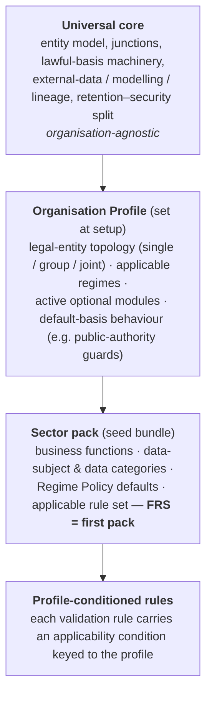
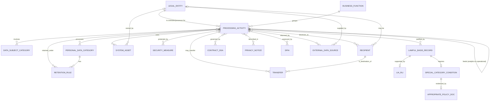

# ROPA Tool — High-Level Plan & Data Architecture

**Purpose:** Design the data model and process for a web-based tool that compiles and maintains a Record of Processing Activities (ROPA) meeting UK data protection law. The tool is a **single-tenant, configurable product**: a universal core tailored at setup by an **Organisation Profile**, with the **Fire and Rescue Service (FRS)** shipped as the first sector profile (see *Configuration & deployment model* below).
**Status:** Draft v0.12 — for iteration. Technical implementation deliberately out of scope at this stage.
**Basis:** UK GDPR Article 30; Data Protection Act 2018 (DPA 2018) Parts 2 & 3; Data (Use and Access) Act 2025 (DUAA); Fire and Rescue Services Act 2004; Regulatory Reform (Fire Safety) Order 2005; Fire Safety (England) Regulations 2022; ICO guidance (accountability framework, documentation, lawful basis, special category data, law-enforcement processing).

## Organisation profile — FRS (the first sector pack)

The facts below are the **FRS Organisation Profile**: configuration values the tool is seeded with at setup, not properties hard-wired into the model. Another organisation type would supply a different profile against the same core (see next section).

- **Fire and Rescue Service, 250+ employees, public authority.** No SME exemption — **all** processing must be documented.
- **Predominantly general processing** under UK GDPR / DPA 2018 Part 2. **Public task (Art 6(1)(e))** is the primary lawful basis, grounded in the Fire and Rescue Services Act 2004, the Fire Safety Order 2005 and the Fire Safety (England) Regulations 2022.
- **The Part 3 boundary is configurable.** The system must support *both* treatments of fire-safety enforcement — as Part 3 law-enforcement processing, or as Part 2 with Art 10 criminal-offence data — set by an org-level policy and switchable per activity without data loss (§1.6). The Part 3 module is therefore always built, but config-gated.
- **Special-category and vulnerable-person data is the centre of gravity**, not an edge case: Home Fire Safety / Safe and Well visits, safeguarding, health/casualty data, children (cadets, schools, firesetter intervention).
- **External datasets inform decisions (manual or automated)** — a generic pattern: data supplied under contract/agreement is combined with FRS-held data to target or identify risk. Instances include **CACI Acorn** (vulnerability inferred), **County Council Adult Care** (special category, direct) and, in future, **NHS data** → source recording, Art 14, DPIA, and ADM handling where a risk model decides rather than informs (§3.6).
- **Emergency Medical Response (EMR)** — a live activity delivered under an ambulance trust's clinical governance → significant casualty/patient health data and a controllership determination the model must *capture* (the actual terms are records held in the system, not fixed here). The trial/pilot lifecycle is retained generically for future use (§3.7–3.8).
- **Both controller and processor** (controller for almost everything; occasionally processor, e.g. shared regional functions) → dual-role modelling retained (§1.5).
- **v1 = full integrated accountability record** (ROPA + lawful basis + DPIA + LIA/RLI + contracts + asset register).
- **Hybrid authoring** — central IG/DP team curates; departments contribute via questionnaire (§5).

---

## Configuration & deployment model

The tool is a **single-tenant, configurable product**. Each organisation runs **its own instance**; there is no shared multi-tenant store, so there is no cross-tenant isolation problem to solve — the right default for a tool whose purpose is demonstrating data-protection rigour. Reusability comes from one configurable codebase, not shared hosting.

**Four layers, cleanly separated:**

- **Universal core** — everything in §3–§4 that isn't sector-specific: the `Processing Activity` entity, junctions, lawful-basis records, the external-data/modelling/lineage pattern, the retention/security split. None of it is fire-specific.
- **Organisation Profile** — chosen at setup. Resolves what were open questions: **legal-entity topology** (single entity / group / joint arrangements) and **which optional modules** (breach, complaints) are active become *configuration*, not build-time decisions.
- **Sector pack** — a seed bundle of reference data and defaults. The FRS work in this document is the **first pack**; police, ambulance/NHS, local authority or a generic controller/processor pack can follow later.
- **Profile-conditioned rules** — the validation rules (§4) are not all universal. Several are public-authority-specific (e.g. blocking legitimate interests / RLI for statutory tasks; Part 3 availability). Each rule therefore carries an **applicability condition** keyed to the profile, so a private-sector tenant doesn't inherit public-authority guards.

**Sequencing (confirmed).** Build the **configuration seams now** — Organisation Profile, the sector-pack mechanism, and a profile-conditioned rule engine — but populate exactly **one** pack first (FRS) and ship a working register for the service. Further profiles are added later against a proven core, so reusability is captured without delaying v1. The plan deliberately avoids building an abstract platform with no user.

**Scope boundary.** The tool **documents processing** (the ROPA and its supporting accountability records). It is **not** a data-subject-rights / SAR case-management system, even though the ICO accountability framework treats information rights as its own area — rights-request handling stays in whatever system already does it. The one adjacent register the tool *does* carry is the **complaints capability**, because the DUAA makes it a statutory controller duty (§1.4) and it links naturally to the processing records.

---

## 1. What the law actually requires

A ROPA is the mechanism for demonstrating compliance with the **accountability principle** (Art 5(2)). Getting the scope right first avoids building fields nobody needs.

### 1.1 Mandatory fields — Controller (Art 30(1))

| # | Field | Notes |
|---|-------|-------|
| 1 | Organisation name & contact details | Plus, where applicable, joint controllers, representative, DPO. For an FRS: the Fire Authority / Chief Fire Officer as controller |
| 2 | Purposes of the processing | e.g. incident response, home fire safety, fire safety enforcement, recruitment |
| 3 | Categories of individuals (data subjects) | e.g. members of the public, casualties, vulnerable persons, duty holders, employees, cadets |
| 4 | Categories of personal data | e.g. contact details, health, safeguarding concerns, criminal offence data |
| 5 | Categories of recipients | Police, NHS/ambulance, local authorities, social services, processors |
| 6 | Third-country / international-org transfers | e.g. cloud hosting outside the UK |
| 7 | Safeguards for exceptional transfers | Art 49(1) second sub-paragraph transfers |
| 8 | Retention schedules | Per data category "if possible" |
| 9 | General description of technical & organisational security measures | "if possible" |

### 1.2 Mandatory fields — Processor (Art 30(2))

| # | Field | Notes |
|---|-------|-------|
| 1 | Processor name & contact details | Plus DPO if applicable |
| 2 | Name & contact of **each controller** acted for | And each controller's representative if applicable |
| 3 | Categories of processing carried out per controller | |
| 4 | Third-country transfers + exceptional-transfer safeguards | As above |
| 5 | General description of security measures | "if possible" |

### 1.3 Additions the ICO treats as good practice / required alongside the ROPA

The ROPA should link to (not necessarily contain) the wider accountability record:

- **Lawful basis (Art 6)** and the reason for it — see §4.
- **Special category condition (Art 9)** and any **DPA 2018 Schedule 1** condition, plus the **Appropriate Policy Document (APD)** where required.
- **Criminal offence data (Art 10)** — official authority or a Schedule 1 condition.
- Source of the data (needed for privacy notices).
- Records of **consent**; controller–processor **contracts**; **DPIA** reports; **LIA/RLI** records; **retention & erasure** policies; **breach** records; location of the data / **asset register** entry.

### 1.4 DUAA 2025 — what has changed (and what it means for a public authority)

The DUAA amends (not replaces) the UK GDPR. The main Part 5 data-protection provisions were commenced on **5 February 2026** by the Commencement No. 6 Regulations (SI 2026/82); the **complaints duty commences 19 June 2026** (s103, new s164A DPA 2018). ICO governance changes (Part 6) follow later.

- **Seventh lawful basis — Recognised Legitimate Interest (RLI), Art 6(1)(ea).** A defined list of recognised interests (new Annex 1) that need **no balancing test**: national security / public security / defence; detection, investigation or prevention of crime; responding to requests from bodies acting in the public interest for purposes laid down in law; and safeguarding of vulnerable individuals. **Several overlap FRS activity** (safeguarding, crime prevention). But for your **statutory tasks, public task (Art 6(1)(e)) remains the natural basis**; whether a public authority can rely on (ea)/(f) for task-related processing is nuanced and ICO guidance is still developing (final RLI guidance expected 2026). The tool should **steer to public task and flag (ea)/(f) for DPO review**, not hard-block. *(Refined from earlier drafts, which overstated an outright bar.)*
- **Automated decision-making reformed (s80; Arts 22A–22D replace Art 22).** A permission-plus-safeguards model; the restriction now bites mainly where a significant decision is based wholly or partly on **special category data**. Relevant to Acorn-style risk targeting.
- **International transfers (s85) — new "data protection test".** Controllers/processors relying on appropriate safeguards must assess whether protection in the destination is **"not materially lower"** than the UK standard. Relevant to the Transfer module.
- **Children's higher-protection matters (new Art 25 duty).** Online services likely to be accessed by children must take account of specified children's higher-protection matters. An FRS generally isn't an information society service, but an online youth-engagement service could engage this — relevant to `children_flag`.
- **Purpose limitation / further processing clarified** (compatible re-use; a broader "scientific research" definition; broad consent for research). Relevant to combining datasets for modelling.
- **New complaints duty (s103; s164A DPA 2018; in force 19 June 2026).** A **statutory controller obligation, not optional**: provide an easy route to complain (including an electronic complaints form), prominently linked from privacy notices; **acknowledge within 30 days**; take appropriate steps to respond; tell people they can escalate to the ICO. The Secretary of State may later require controllers to report complaint numbers to the regulator. So the tool's complaints capability defaults **on** for a UK-controller profile (§7).
- **ICO → Information Commission (Part 6, later commencement).** The regulator is being reconstituted as the Information Commission (the chair keeps the title "Information Commissioner"; functions unchanged). Terminology watch-item — "ICO" in export labels and "report to the ICO" wording will eventually become "Information Commission."
- **Art 6(1)(e) public task** clarified — must be *your* task, not another controller's.

**Design implication:** treat lawful basis, ADM, transfers and complaints as configurable so legal change is a data update, not a rebuild.

### 1.5 Operating as both controller and processor

`controller_or_processor` on each activity is a routing field that changes which mandatory set and which linked records apply:

- **Controller activities** (almost all FRS processing) carry the full Art 30(1) set, plus lawful basis (Art 6/9/10), DPIA, LIA/RLI, privacy notice and retention.
- **Processor activities** (occasional — e.g. hosting a shared regional system for another authority) carry the Art 30(2) set, grouped **by the controller acted for**; no lawful basis of your own; link to the Art 28 contract.
- **Joint controller** (common in multi-agency safeguarding / resilience work) is its own value, requiring an Art 26 arrangement and shared privacy information.

Export three separable views — controller ROPA, processor ROPA, combined internal register — because the ICO expects controller and processor records to be distinguishable on request.

### 1.6 Regime router — general processing vs the narrow Part 3 sliver

Each activity carries a **`regime`** flag, defaulting to **general** (UK GDPR / DPA 2018 Part 2). A small set of enforcement activities *may* be **law enforcement (Part 3)**:

- Part 3 applies only to a **competent authority** processing for **law-enforcement purposes** (prevention, investigation, detection or prosecution of criminal offences). An FRS's primary purpose is *not* law enforcement, so most processing is Part 2.
- The candidate exception is **fire-safety enforcement / prosecution** under the Fire Safety Order 2005 and Fire Safety (England) Regulations 2022 — a statutory prosecuting function that can make you a competent authority "to the extent" of that function. Some FRSs (e.g. London Fire Brigade) carry an explicit "law-enforcement processing" ROPA category; others treat fire-safety enforcement as ordinary Part 2 processing with Art 10 criminal-offence data.

**The boundary is configurable — the system supports both.** Rather than hard-code a regime per activity type, the tool holds an org-level **Regime Policy** (§3.3) that maps "enforcement-domain" activities to `part2` or `law_enforcement`. Each affected activity inherits that policy but can be individually overridden, and **switching regime must not lose data**: the two legal mappings coexist and the active regime decides which is live and exported (§1.6a).

If any activities are treated as Part 3, they need a *parallel* record set, because Part 3 differs from Article 30:

- **s61 record of processing** — similar content to Art 30 but a distinct obligation.
- **s62 logging** — automated systems must log collection, alteration, consultation, disclosure, combination and erasure, recording time, date and (so far as possible) who accessed or disclosed the data. *(DUAA s82 removed the earlier requirement to also record a justification/"why".)* The tool doesn't produce these logs but should **flag which systems are in scope** and reference where logs live.
- **s35 lawful basis** — not Art 6; LE processing is lawful only if based on law *and* either consent or necessary for a competent authority's task.
- **Sensitive processing (s35(8))** → needs a **Schedule 8** condition and an **APD (s42)** — a *different* APD from the Schedule 1 one used in the general regime.
- **s38 data-subject categorisation** — must distinguish suspects / convicted / victims / witnesses, and fact from personal assessment.

**Design implication:** the regime flag is the *first* router (above controller/processor). Keep Part 3 as a lightweight, clearly-bounded module rather than the organisational core.

#### 1.6a How the configurable boundary works

| Element | Behaviour |
|---------|-----------|
| **Regime Policy (org config)** | A setting per activity domain — e.g. `fire_safety_enforcement = part2 \| law_enforcement`, `fire_investigation = …`, `firesetter_intervention = …`. One place to change how the organisation classifies these functions. |
| **Activity `regime_source`** | `policy` (inherits the domain default) or `manual_override` (a specific activity is classified differently, with a documented reason). |
| **Dual mapping, one active** | For enforcement-domain activities the tool can hold *both* a Part 2 basis record (Art 6 + Art 10 + Sch 1 + Sch 1 APD) *and* a Part 3 basis record (s35 + Sch 8 + s42 APD). The active `regime` flags which is authoritative; the other is retained, not deleted, so flipping the policy is reversible. |
| **Regime change = audited event** | Who changed it, when, why — because reclassifying enforcement processing is a significant accountability decision. |
| **Validation & export follow the active regime** | Rules (§4) and the ICO export (Art 30 vs s61 view) key off the live regime. |

This satisfies "support both approaches" without forcing a rebuild if the DPO's position changes, and lets different enforcement functions sit in different regimes simultaneously.

---

## 2. Design principle: granularity and meaningful links

The single most important ICO point: a generic list of data items with no links between them **does not meet Article 30**. Within one processing activity, different data-subject categories often attract different data categories, recipients and retention periods — acute for an FRS, where a single "Home Fire Safety" activity spans healthy adults, vulnerable adults, and children, each with different data and safeguards. The model must be **relational**, not a flat spreadsheet row per activity.

Recommended authoring flow (ICO's own suggested approach): start broad and narrow down —
**Business function → Processing activity → (data subjects, data categories, recipients, lawful basis, retention, transfers, security) with explicit links.**

---

## 3. Data architecture

### 3.1 Entity–relationship overview

*Part 3 activities reuse this shape but swap the lawful-basis branch for the s35 / Schedule 8 / s42-APD set, and add an s62-logging flag on the linked systems. The diagram is **illustrative, not exhaustive** — config entities (Organisation Profile, Regime Policy) and some linked records (Decision-support/ADM, Consent, Breach, Complaints) are omitted for clarity.*

### 3.2 Core entity: `Processing Activity`

The central record. One row per distinct activity, grouped under a business function.

| Attribute | Type | Purpose |
|-----------|------|---------|
| id | key | |
| name / reference | text | e.g. "Home Fire Safety Visits" |
| business_function_id | FK | Response, Prevention, Protection, Corporate… |
| description | text | What the activity does |
| **activity_type** | enum | `operational` / `analytics_modelling` — modelling/scoring is recorded as its own activity, linked to the operational activities it feeds (§3.6) |
| **regime** | enum | `general` (default) / `law_enforcement` — first router (§1.6) |
| **regime_source** | enum | `policy` (inherits Regime Policy) / `manual_override` (+ reason) — §1.6a |
| controller_or_processor | enum | `controller` / `processor` / `joint` |
| **lifecycle_stage** | enum | `trial` / `live` / `retired` — pilots are time-bound and gated (§3.8) |
| **trial_start / trial_end** | dates | For pilots; drives review-before-go-live and expiry alerts |
| purpose | text | Art 30 / s61 purpose(s) |
| **personal_data_source** | enum (multi) | `from_data_subject` (Art 13) / `from_third_party` / `public_source` — drives the right transparency route; external datasets also link via §3.6 |
| categories_of_processing | text | (Processor records) |
| status | enum | draft / active / retired |
| owner_id | FK | Accountable person/department |
| created / last_reviewed / next_review | dates | Review cycle |
| special_category_flag | bool | Derived from linked data categories |
| criminal_offence_flag | bool | Derived (Art 10 / fire investigation, vetting) |
| **vulnerable_or_safeguarding_flag** | bool | Adults at risk / safeguarding — extra safeguards & likely DPIA |
| **children_flag** | bool | Cadets, schools, firesetter schemes — children's protections |
| **external_data_use_mode** | enum | `none` / `manual` / `automated` — is an external dataset used to inform decisions, and how (§3.6) |
| **lineage_granularity** | enum | `activity` (baseline) / `record` — record-level provenance required for automated modelling, to answer Art 15/22 (§3.6) |
| adm_profiling_flag | bool | Derived: true when `external_data_use_mode = automated` or any solely-automated decisioning is present |
| high_risk_flag | bool | Triggers DPIA screening |

### 3.3 Reference / lookup entities (controlled vocabularies)

Managed lists (not free text) are what produce the "meaningful links" and make reporting and legal updates tractable. FRS-oriented seeds shown.

| Entity | Key attributes | FRS seed / source |
|--------|----------------|-------------------|
| **Organisation Profile** *(setup config)* | org type, legal-entity topology (`single`/`group`/`joint`), applicable regimes, active optional modules, default-basis behaviour (e.g. public-authority guards on/off), sector pack | The single-tenant setup record; the FRS pack seeds it (see *Configuration & deployment model*) |
| **Regime Policy** *(org config)* | activity domain, assigned regime (`part2`/`law_enforcement`), rationale, last changed by/when | Sets how enforcement-domain functions (fire-safety enforcement, fire investigation, firesetter intervention) are classified — the switch behind §1.6a |
| **External Data Source** | name, supplier legal entity, **supplier role** (`processor` / `separate controller`), agreement/contract or DSA ref, data categories supplied, **special-category** (`none` / `inferred` / `direct`), source-to-subject relationship (Art 14) | Any dataset supplied under contract/agreement to inform decisions — e.g. **CACI Acorn** (commercial; vulnerability *inferred*), **County Council Adult Care** (partner; special category *direct*), **NHS data** (future; health, *direct*) |
| **Legal Entity** | name, contact, role type, address, country | Fire Authority / CFO (controller), DPO, SIRO, processors, partner agencies, **CACI**, **ambulance trust** (EMR clinical governance) |
| **Business Function** | name | Response/Operations; Prevention & Community Safety; Protection (Fire Safety Regulation & Enforcement); Fire Investigation; Youth & Early Intervention; Corporate/HR/OH; Business Support (procurement, legal, comms, CCTV/drones, archiving, PSED) |
| **Data Subject Category** | name, `le_classification` (Part 3 only) | Members of the public; casualties/persons at incidents; vulnerable persons; duty holders / business owners; employees (current/past/prospective); volunteers & on-call; cadets/children; partner-agency & emergency-service staff; complainants |
| **Personal Data Category** | name, `is_special_category`, `is_criminal_offence` | Contact; household/premises; **health** (casualty, OH, EMR); **safeguarding concerns**; **criminal offence** (fire investigation, vetting); racial/ethnic (PSED monitoring); biometric; financial |
| **Recipient** | name, type (internal / processor / joint controller / public body / other), linked legal entity | Police; NHS/ambulance; local authority; social services; coroner; ICO; cloud processors |
| **Lawful Basis — general (Art 6)** | code, label, `public_authority_restricted` | (a) Consent, (b) Contract, (c) Legal obligation, (d) Vital interests, (e) **Public task** (default), (ea) RLI *(restricted)*, (f) Legitimate interests *(restricted)* |
| **Lawful Basis — LE (s35)** | code, label | Based on law + (consent OR necessary for a competent authority's task) |
| **Special Category Condition (Art 9)** | code, label, `needs_schedule1`, `needs_apd` | 10 conditions (a)–(j); key FRS ones: (a) explicit consent, (c) vital interests, (g) substantial public interest, (h)/(i) health |
| **Schedule 1 Condition (DPA 2018)** | paragraph, label, part | FRS-relevant: para 18 safeguarding of children/individuals at risk; para 8 equality of opportunity; para 10 preventing/detecting unlawful acts; health conditions |
| **Schedule 8 Condition (Part 3 only)** | paragraph, label | Sensitive-processing conditions for any LE-regime activities |
| **Security Measure** | name, category (technical / organisational) | Encryption, access control, MDT/appliance controls, training |
| **System / Asset** | name, owner, location, hosting country, **security (authoritative)**, **default retention (suggestion only)**, `s62_logging_in_scope` | Incident recording, mobilising, CFRMIS/community safety, HR, OH systems |
| **Third Country / Int'l Org** | name, adequacy status | Cloud regions |
| **Transfer Mechanism** | name | Adequacy, IDTA/SCCs, BCRs, Art 49 exception |
| **Retention Rule** | label, period, trigger, legal driver, disposal method | Incident, safeguarding, employee, enforcement records |

### 3.4 Relationship (junction) entities

These carry the granularity the ICO requires:

- `activity_datasubject` — activity ↔ data subject category
- `activity_datacategory` — activity ↔ personal data category *(scoped to a data-subject category where they differ — essential for HFSV, where adults/vulnerable adults/children diverge)*
- `activity_recipient` — activity ↔ recipient
- `activity_security` — activity ↔ security measure (often inherited from system/asset)
- `activity_system` — activity ↔ system/asset
- `activity_contract` — activity ↔ contract / data-sharing agreement
- `activity_privacynotice` — activity ↔ published privacy notice
- `activity_datasource` — activity ↔ external data source *(which datasets inform this activity — the activity-level lineage baseline)*
- `activity_feeds` — analytics/modelling activity → operational activity *(records that a model feeds one or more operational uses; supports one-model-to-many-uses)*
- `activity_retention` — activity / data-category ↔ retention rule *(applies a library rule from §3.3; resolves the "retention in two places" ambiguity — the library holds the rule, the junction applies it, mirroring `activity_security`)*

### 3.5 Supporting / linked records (all in v1 scope)

| Entity | Links to | Holds |
|--------|----------|-------|
| **Lawful Basis Record** | activity | general: Art 6 basis + justification; Art 9 condition + Sch 1 + APD where special category; Art 10 basis where criminal offence. LE: s35 basis; Sch 8 + s42 APD where sensitive |
| **LIA / RLI Record** | lawful basis record | Rare for you — only for non-task processing relying on (f)/(ea) |
| **Consent Record** | lawful basis record | Where basis = consent (a): what was consented to, wording shown, when/how, and withdrawal status; proactive-review date. **Where `children_flag`**: age-check outcome and parental/guardian consent capture. (Universal-core entity — load-bearing for future commercial profiles even if narrow for the FRS.) |
| **Appropriate Policy Document** | special category / sensitive-processing condition | Sch 1 APD (general) and/or s42 APD (Part 3); retain to 6 months after processing ends |
| **Transfer** | activity, recipient, third country | Mechanism + safeguards + **"not materially lower" data-protection test (DUAA s85)** |
| **Retention Rule** | applied to activity / data category via `activity_retention` | Library entity (§3.3); the junction applies it. Period, trigger, disposal |
| **DPIA** | activity | Screening + assessment; expected for safeguarding, children, health-at-scale, profiling |
| **Contract / DSA** | activity, legal entity | Art 28 processor terms / multi-agency data-sharing agreements, review date |
| **Privacy Notice** | activity | Version, publish date (source of truth for transparency) |
| **Breach Record** *(toggleable module — §7)* | activity | Accountability record for personal-data breaches |
| **Complaints Record** *(module — statutory for controllers, §1.4/§7)* | activity (optional) | Complaint intake, 30-day acknowledgement clock, response tracking, ICO-escalation flag; supports possible future duty to report complaint numbers |
| **Decision-support / ADM Record** | activity, external data source(s) | Use mode (manual/automated); for automated: technique, solely-automated? significant effects? accuracy & bias checks, human review, contestability; safeguards; transparency ref (§3.6) |

### 3.6 External data & decision support (manual or automated)

A generic pattern the system must handle: an **external dataset supplied under contract/agreement is combined with FRS-held data to inform a decision** — targeting, prioritisation, vulnerability identification. Acorn is one instance; others include County Council Adult Care data and, in future, NHS data. The processing may be **manual** (a person reviews the data to inform a decision) or **automated** (a risk model scores or flags individuals). The model captures the pattern; the specific datasets and arrangements are records held in the system.

Modelling points that apply across all instances:

- **External source, not collected from the individual** → record the source and satisfy **Art 14** (data obtained other than from the data subject) in the privacy notice.
- **Supplier role is recorded per source** — the supplier may act as your **processor** or supply data as a **separate controller**; either is a `supplier role` value, not a design fork (see §3.3).
- **Special category — direct *or* inferred.** Some sources *are* special-category data (Adult Care, NHS health); others let it be *inferred* (geodemographic segmentation proxying age/health/vulnerability). Both set the Art 9 position and DPIA obligation; the `special-category` flag on the source distinguishes them.
- **Use mode drives the ADM assessment.** `manual` → source recording, Art 14, lawful basis, and DPIA where vulnerable/scale. `automated` → additionally a Decision-support/ADM record: is it a **solely automated decision with legal or similarly significant effects** (Art 22/22A–22D)? If it merely informs a human (e.g. an *offered* HFSV), record that finding explicitly; if it decides, require the Art 22A–22D safeguards, plus accuracy/bias checks, human review and contestability.
- **Combining datasets** raises purpose-limitation and minimisation questions and, with vulnerable people at scale, makes a **DPIA effectively mandatory**. Lawful basis remains **Art 6(1)(e) public task**; partner sharing (Adult Care, NHS) needs its own basis and a **DSA**, with an Art 9 condition (e.g. safeguarding, health/social care, vital interests).
- **Modelling is its own activity (confirmed).** Building/running a risk model — combining datasets and scoring individuals — is recorded as an `activity_type = analytics_modelling` activity, **linked via `activity_feeds`** to the operational activities that act on its output (e.g. HFSV targeting). This keeps the DPIA/ADM weight on the model itself and lets one model feed several operational uses.
- **Lineage (confirmed): activity-level baseline, record-level for automated modelling.** Every activity records *which* external sources inform it (`activity_datasource`). Where an activity is automated modelling that materially affects individuals, `lineage_granularity = record` so the system can trace which sources contributed to a specific individual's score/flag — the provenance needed to answer an Art 15 or Art 22 request ("why was I flagged").

### 3.7 Externally-governed health processing (illustrated by EMR)

Some activities involve special-category **health data** processed under **another body's clinical or operational governance** — for example Emergency Medical Response (EMR), a live activity delivered under an ambulance trust's clinical governance. The model must handle this *pattern*; the specific terms and governance are records held **in** the system, not fixed in this design.

- **Health data is special category** → the activity carries an Art 9 route and, given sensitivity and scale, DPIA screening. Which condition applies is recorded per activity.
- **Controllership is captured, not assumed** — the record can express controller / processor / joint controller and link the relevant arrangement/DSA, so the actual position is a data entry, not a design assumption.
- **Don't default to sole controller** where processing is carried out under another body's governance — the tool should *prompt* the controllership question rather than pre-fill it.

### 3.8 Activity lifecycle (trials & pilots)

Retained as a general capability — useful for future pilots and for other organisations, even though no trial is running now:

- `lifecycle_stage = trial | live | retired`, with `trial_start` / `trial_end`.
- A **DPIA and a review gate** before a trial becomes `live`, and **expiry alerts** so pilots don't silently become permanent, undocumented processing.

### 3.9 Where retention and security live (inheritance model — confirmed)

The two attributes behave differently, so they're held at different levels:

- **Security is held on the System/Asset and inherited** by every activity linked to it — one curated description, maintained centrally by IG/IT, no re-keying by departmental contributors. Activities may add activity-specific measures on top, but the baseline comes from the system.
- **Retention is held on the activity (or its data categories)**, because it's driven by purpose, data type and lawful basis — not by where the data physically sits. The same system can hold safeguarding, routine-visit and incident records under different schedules. The linked system offers a **default retention** that the activity author can **override**.

This keeps system-shaped facts consistent and purpose-shaped facts accurate — the right balance for the hybrid authoring model, where contributors may not know a system's security detail but do know their own purpose's retention rules.

---

## 4. Validation & business rules

The tool's value over a spreadsheet is enforcing conditional logic. **Each rule carries an applicability condition keyed to the Organisation Profile** (see *Configuration & deployment model*); rules marked *[profile]* below are not universal and switch off for profiles they don't apply to. The FRS (public-authority) profile enables all of them.

1. If any linked data category `is_special_category` → **require** an Art 9 condition (general) or confirm sensitive-processing route (LE); set `special_category_flag`.
2. If the Art 9 condition needs Sch 1 → **require** a linked Schedule 1 condition **and** an APD reference.
3. If any linked data category `is_criminal_offence` → **require** Art 10 official authority *or* a Schedule 1 condition (general regime).
4. *[profile: public authority]* **Public-authority guard:** if `regime = general` and the activity is a statutory task → **default** Art 6(1)(e) public task; **flag** (f) legitimate interests and (ea) RLI for DPO review (their availability for a public authority's task-related processing is nuanced and guidance-dependent — steer, don't hard-block).
5. If Art 6 basis = legitimate interests (f) → require a completed LIA (only reachable for non-task processing).
6. If Art 6 basis = consent (a) → require a **Consent Record** (what/when/how consented, wording shown, withdrawal status). If `children_flag` and consent is relied on → additionally require an age-check outcome and parental/guardian consent capture.
7. If `vulnerable_or_safeguarding_flag` or `children_flag` → **require** DPIA screening and prompt for extra safeguards; steer Art 9 toward (g)+Sch 1 para 18 with an APD.
8. **External data / decision support** (§3.6). If `external_data_use_mode ≠ none` → require ≥1 linked External Data Source and an Art 14 privacy-notice reference. If `= automated` → require a Decision-support/ADM record and an Art 22A–22D assessment (solely-automated + significant effects); stricter path (safeguards, human review, contestability) where the model decides rather than informs.
9. If a linked External Data Source has `special-category = inferred` **or** `direct` → set the Art 9 position and **require DPIA screening**, even where no special-category field is collected directly (inference case).
10. **Modelling & lineage** (§3.6). If `activity_type = analytics_modelling` → require ≥1 `activity_feeds` link to the operational activity(ies) it serves, and a DPIA. If such an activity is automated and materially affects individuals → set `lineage_granularity = record` and require record-level provenance capability (Art 15/22).
11. If a Transfer exists → **require** a transfer mechanism and safeguard, and (for appropriate-safeguards transfers) a recorded **"not materially lower" data-protection test** (DUAA s85).
12. **Regime routing.** `regime` derives from the Regime Policy unless `regime_source = manual_override` (which requires a reason). If `regime = law_enforcement` → switch to the s61 field set + s35 lawful basis; require sensitive-processing condition (Sch 8) + s42 APD where sensitive; flag linked systems for s62 logging. If `regime = general` for the same activity → require the Art 6/10 + Sch 1 set instead. Retain the inactive mapping; **log every regime change** (who/when/why).
13. If `controller_or_processor = processor` → switch to Art 30(2); require ≥1 linked controller legal entity. If `joint` → require an Art 26 arrangement reference.
14. **Trial gate.** If `lifecycle_stage = trial` → require a DPIA and a `trial_end`; block transition to `live` without DPO sign-off; alert as `trial_end` approaches.
15. **Retention & security inheritance** (§3.9). Security measures inherit from linked systems (activity-specific additions allowed on top). Retention is set at activity/data-category level; the tool pre-fills a default from the linked system, which the author can override.
16. Every activity must have an owner and a `next_review` date; surface overdue reviews.
17. **Audit & version history** (universal core). All records carry a change history — who changed what, when — with prior versions retained; the regime-change audit (rule 12) is one instance of this general capability.

---

## 5. Process / workflow (the operating model, not just the data)

A ROPA fails if it doesn't match what people actually do. The tool should support the lifecycle:

1. **Data mapping / information audit** — identify what personal data is held and how it flows. Seed business functions and systems.
2. **Discovery via questionnaire** — distribute jargon-free questions to each function; import answers into draft activities.
3. **Draft** — DP team / function owners complete records; validation rules guide completeness.
4. **Review & approve** — DPO or IG lead signs off; lawful basis justified.
5. **Publish links** — connect to privacy notices, contracts, DPIAs.
6. **Maintain** — scheduled reviews, change-triggered updates, data-minimisation reviews, overdue-review dashboard.
7. **Evidence on demand** — export the Art 30 (and, if used, s61) record for the ICO; produce KPI/coverage reports.

### 5.1 Hybrid authoring — roles & permissions

| Role | Can do | Cannot do |
|------|--------|-----------|
| **Contributor** (department) | Create/edit draft activities for their function; answer questionnaires; propose new reference values | Approve records; publish; edit shared reference lists directly; set final lawful basis |
| **Curator** (IG/DP team) | Approve proposed reference values; edit any activity; run data-mapping; manage retention/security libraries | Independent sign-off (kept separate for objectivity) |
| **Approver / DPO** | Independent sign-off; validate lawful basis & regime; set records `active`; oversee reviews | — |
| **Viewer / senior mgmt / SIRO** | Read, dashboards, assurance reports | Edit |

**Reference-data governance is the key hybrid-model risk.** If contributors add free-text data categories or recipients, the "meaningful links" break down. Recommendation: contributors *propose* new controlled values; curators *approve* them into the shared library.

**Questionnaire ingestion:** map answers onto draft activities and pre-tag by function, so departmental input lands as structured drafts a curator can validate — not free text to re-key.

---

## 6. Delivery approach — v1 is the full integrated record

v1 is the whole accountability record. It's a large build, so the value is a sensible internal build order; each stage produces something usable.

| Stage (within v1) | Focus | Usable outcome |
|-------|-------|---------|
| **0 — this doc** | Data architecture + process design | Agreed model to build against |
| **1a — Core + routers + config seams** | Processing activity, Art 30(1)/(2) sets, regime + controller/processor routing, **Organisation Profile + sector-pack mechanism + profile-conditioned rule engine**, Regime Policy config with override + change audit, reference vocabularies, junctions | A compliant, exportable record with the configurable boundary; **FRS pack populated first** |
| **1b — Lawful basis layer (both regimes)** | Art 6/9/10 + Sch 1 + APD **and** s35 + Sch 8 + s42 APD, **consent records** (incl. children/parental), dual mapping for enforcement domains, public-authority guards, validation rules | Justified bases either side of the boundary |
| **1c — Linked registers** | DPIA, contracts/DSAs, asset register, retention, privacy notices, transfers, **Decision-support/ADM + External Data Source (manual & automated)** | Integrated accountability record |
| **1d — Hybrid workflow + trials** | Roles/permissions, questionnaire ingestion, propose-and-approve reference data, review cycles, **trial lifecycle gates** | Distributed authoring; pilots tracked |
| **1e — Assurance & export** | Mapping layer over the canonical model → Art 30(1)/30(2)/s61 + combined views, ICO-ready export, dashboards, KPIs, overdue-review & trial-expiry alerts (§6.2) | Living ROPA + reporting |
| **2 — DUAA alignment** | ADM (Art 22A–22D) safeguards, **statutory complaints capability (s164A, 19 Jun 2026)**, transfer "not materially lower" test (s85), children's higher-protection matters, purpose-limitation/further-processing | Current-law compliance |

*The Part 3 record set (s61/s62/Sch 8/s42-APD) is built in 1a–1b but stays dormant unless the Regime Policy activates it — that's how "support both approaches" is delivered without a separate conditional phase.*

### 6.1 Linked-register field sketch (in v1 scope)

- **DPIA** — screening outcome; nature-scope-context-purposes; necessity & proportionality; risks; mitigations; residual-risk rating; DPO advice; sign-off; review date. *Expect one for HFSV/safeguarding, children's schemes, health-at-scale and any household risk-profiling.*
- **LIA / RLI** — mostly N/A (public authority); only for genuinely non-task processing.
- **Contract / DSA** — parties, controller/processor/joint type, Art 28 checklist, security schedule, sub-processor authorisation, sign-off, dates. *Multi-agency safeguarding/resilience DSAs are prominent for an FRS.*
- **Asset register** — asset/system, owner, location, hosting country, security (authoritative), default retention, `s62_logging_in_scope`, risk-assessment date. Activities link to assets so **security inherits** (not re-keyed); **retention** is set on the activity/data-category with a system-suggested default (§3.9).

### 6.2 Export & representation (confirmed)

The internal model is **clean and normalised**; ICO-facing outputs are produced by a **separate mapping/export layer**, not by shaping the stored data to a template.

- One canonical record set → multiple **export views**: controller **Art 30(1)**, processor **Art 30(2)**, and **s61** (for any law-enforcement-regime activities), plus a combined internal register.
- Mappings are **configuration, not schema** — if the ICO changes a template, or you want a differently-formatted export, you edit the mapping, not the data model.
- Keeps the relational granularity intact internally while still delivering the flat, section-ordered layouts an assessor expects.

---

## 7. Decision log & status

*Resolved decisions:* organisation = 250+ FRS (full ROPA); roles = controller, processor **and joint controller** (all modelled); scope = full integrated record; authoring = hybrid, with sign-off roles defined in §5.1; Part 3 boundary = configurable, per-function (both treatments supported); profiling = CACI Acorn (in scope); EMR = live activity under external clinical governance (in scope); system-of-record = **security inherited from assets, retention held at activity/data-category with a system default (§3.9)**; external data used to inform decisions = **generic pattern, manual or automated, supplier role recorded per source (§3.6)**; risk modelling = **separate `analytics_modelling` activity linked to operational use (§3.6)**; lineage = **activity-level baseline, record-level for automated modelling (§3.6)**; export = **clean internal model with a mapping layer generating ICO-aligned exports (§6.2)**; Regime Policy granularity = **per enforcement function (confirmed)**; deployment = **single-tenant, configurable product — a universal core tailored by an Organisation Profile, FRS as the first sector pack** (legal-entity topology and optional modules become setup configuration); sequencing = **build config seams now, ship FRS pack first, add profiles later**. Note: specific arrangements — EMR governance/controllership, CACI/Adult Care/NHS terms — are records to be held **in** the system, not fixed in this design.*

**No open design questions remain that block the core schema.** The architecture is stable enough to move from design into the build specification. Items now handled as **setup configuration** rather than design decisions:

- **Legal-entity topology** (single Fire Authority / combined or joint authority / shared regional service) — an Organisation Profile setting; the model already supports controller, processor and joint controller.
- **Modules:** the **breach log** is a genuine per-profile toggle. The **complaints capability is *not* optional for you** — the DUAA makes it a statutory controller duty from 19 June 2026 (§1.4), so for a UK-controller profile it defaults **on** (30-day acknowledgement, response tracking, ICO-escalation, and the possible future duty to report complaint counts).

Remaining decisions are **content of the FRS pack** (which functions, vocabularies, module defaults to seed) and can be settled during 1a rather than blocking it.

---

*References: UK GDPR Art 30; DPA 2018 Parts 2 & 3 (incl. ss 35, 42, 61, 62; Schedules 1, 7, 8); Data (Use and Access) Act 2025 (ss 70, 80, 82, 85, 103; commenced by SI 2026/82, main provisions 5 Feb 2026, complaints duty 19 Jun 2026); DfSIT DUAA factsheets (gov.uk); Fire and Rescue Services Act 2004; Fire Safety Order 2005; Fire Safety (England) Regulations 2022; ICO guidance on documentation, lawful basis, special category data, law-enforcement processing and the DUAA summary of changes (ico.org.uk).*
