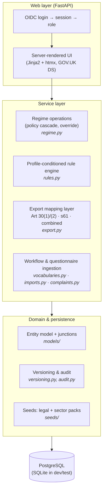

# Cairn — Solution Architecture

**Status:** Solution Architecture v0.1 — the Phase 1.1 deliverable (Project Plan §4). Records the deployment topology, hosting posture, technology stack and component design; the detail behind each area lands in Phases 1.3–1.6.
**Derives from:** Project Plan v0.1 (`Cairn-project-plan.md`), Plan v0.12 (`ROPA-tool-plan.md`), Spec v0.4 (`ROPA-tool-field-spec.md`). Builds on the validated Phase 1.7 spike and the Phase 1.2 physical data model (`src/cairn/`).

---

## 1. Decisions this document records

| Open item (Project Plan §11) | Decision |
|---|---|
| §11.1 Build model | **In-house development** — this repository is the product codebase. |
| §11.2 Hosting | **Cloud-agnostic containers.** No cloud-specific dependencies in the application; a documented **reference deployment on a UK cloud region** (e.g. Azure UK South / AWS London). Each organisation deploys its instance to its own estate — UK cloud or on-premise — which suits a single-tenant product whose customers' infrastructure differs. |
| Application stack | **FastAPI + server-rendered UI** (Jinja2 templates + htmx) over the existing Python 3.14 / SQLAlchemy 2 kernel. Server-rendered HTML with **GOV.UK Design System** components is the most direct route to WCAG 2.2 AA (Phase 3 requirement). |
| Database | **PostgreSQL** in production; SQLite remains for dev/tests. **Alembic migrations adopt at the start of sub-phase 2a** — the Phase 1.2 deferral was "until the stack is fixed", and this document fixes it. |

Still open (deliberately): resourcing/timeline (§11.3), migration-source format (§11.4), pilot scope (§11.5), reuse ambition (§11.6).

## 2. Deployment topology

Single-tenant, per Plan (*Configuration & deployment model*): **one instance per organisation, no shared store, no cross-tenant isolation problem**. An instance is:

- **App container** — FastAPI application (UI + any service endpoints), stateless, horizontally scalable though a single replica suffices for the user population.
- **PostgreSQL** — the organisation's own managed service or container; holds everything (records, versions, audit events, seeds).
- **Reverse proxy / TLS termination** — the host estate's standard (cloud load balancer, or nginx on-prem).

Nothing else is required at go-live: no message queue, no cache, no object store. Exports are generated on demand from the mapping layer (Spec §10). If report generation ever needs offloading, a worker container is an addition, not a redesign.

## 3. Technology stack

| Layer | Choice | Rationale |
|---|---|---|
| Language | Python 3.14 | Established in the kernel; team preference |
| Web framework | FastAPI | Async, typed, minimal; serves templates and JSON equally well if an API surface is later wanted (integration hooks, Phase 1.4) |
| UI | Jinja2 + htmx, GOV.UK Design System | Forms-heavy CRUD with progressive enhancement; accessibility largely solved at the component level; no frontend build chain |
| ORM / DB | SQLAlchemy 2 → PostgreSQL (prod), SQLite (dev/test) | Kernel already validated on it; the versioning listener (rule 17) lives here |
| Migrations | Alembic from sub-phase 2a | Schema now stable enough; PostgreSQL target fixed |
| AuthN | OIDC to the organisation's IdP (commonly Entra ID in FRS estates); server-side sessions | SSO is a Phase 1.3 requirement; OIDC keeps it estate-agnostic |
| AuthZ | The four Plan §5.1 roles, mapped from IdP groups at login | RBAC detail in Phase 1.3 |
| Packaging | OCI containers (Dockerfile, docker-compose reference) | The hosting-posture decision |
| Tooling | uv, pytest, ruff | Established |

## 4. Component design

- The **service layer accreted through sub-phases 2a–2f** (all built); the domain layer was built in Phase 1.2.
- The four configuration layers from the Plan (universal core → Organisation Profile → sector pack → profile-conditioned rules) are **data and seed concerns, not deployment concerns** — one container image serves every profile.
- The **export mapping layer stays configuration-driven** (Spec §10): views are generated, never stored.

## 5. Environments (frame for Phase 1.6)

| Environment | Database | Purpose |
|---|---|---|
| dev | SQLite in-memory / file | Local development, fast tests |
| test/staging | PostgreSQL (containerised) | Integration, UAT, accessibility and pen-testing (Phase 3) |
| prod | PostgreSQL (managed or estate-hosted) | Live instance per organisation |

CI runs pytest + ruff on every change; image build and release process are Phase 1.6 detail.

## 6. Interfaces to later phases

- **1.3 Security architecture** — inherits: OIDC/SSO, role mapping, TLS at the proxy, encryption at rest via the database/volume layer, and the already-built audit trail and version history (rule 17). To define: session policy, secrets management, NCSC/Cyber Essentials alignment.
- **1.4 Integration architecture** — FastAPI gives a natural JSON surface if/when external-data ingestion, asset-register sync or complaints intake need machine interfaces; none is assumed at go-live.
- **1.5 NFRs** — the topology's simplicity is the availability story (stateless app + backed-up database); backup/DR targets to be set against the organisation's own standards.

---

*Solution Architecture v0.1. Resolves Project Plan §11.1–§11.2; will iterate as Phases 1.3–1.6 add detail.*
